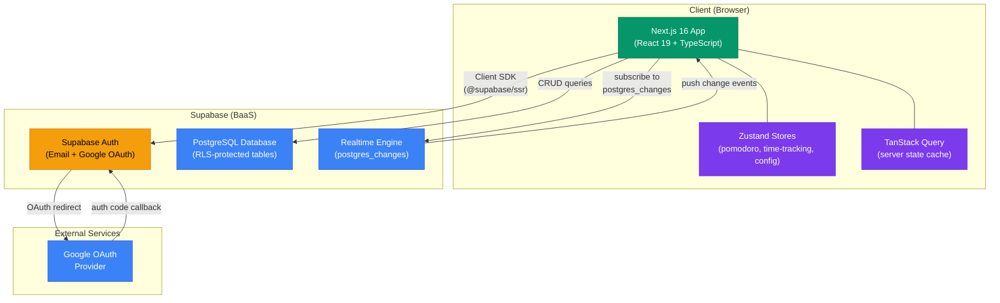
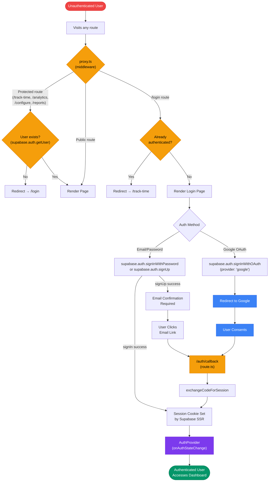
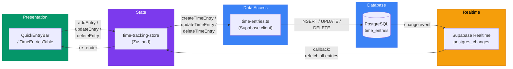
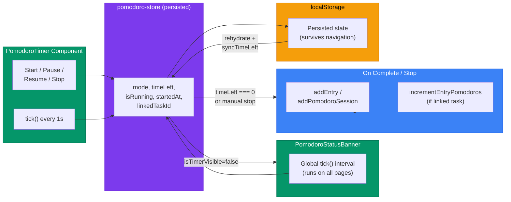
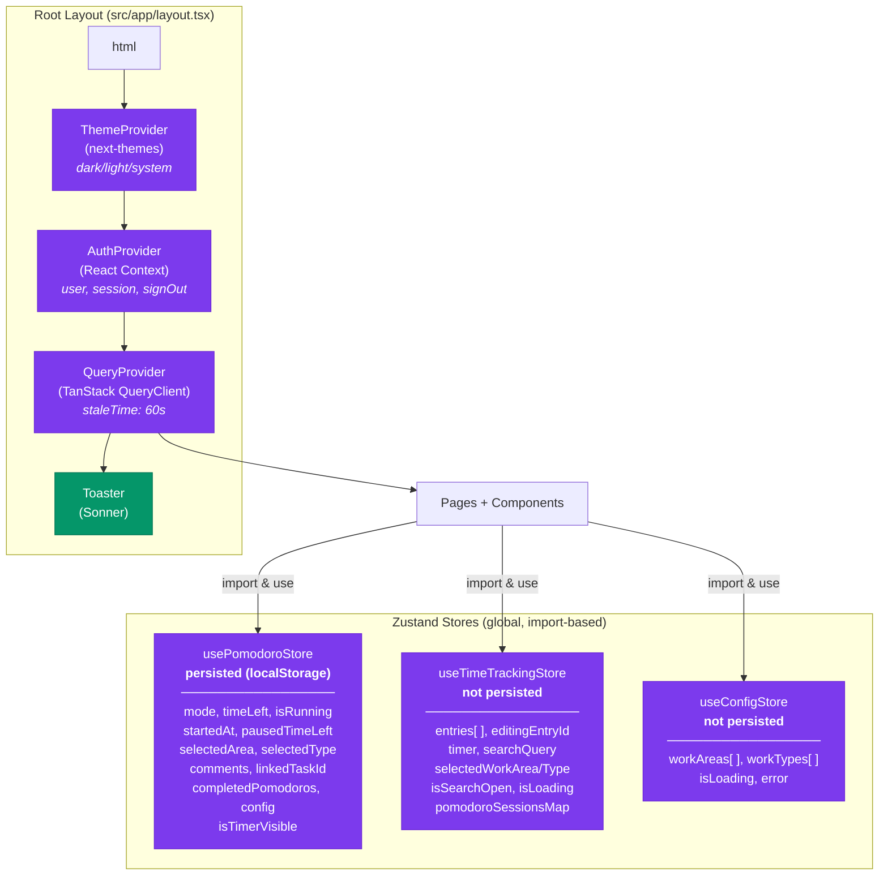
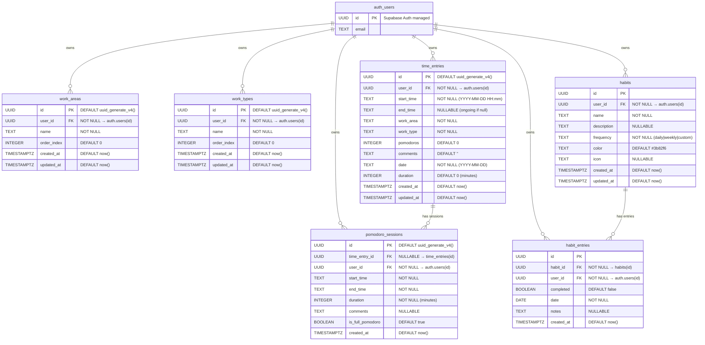
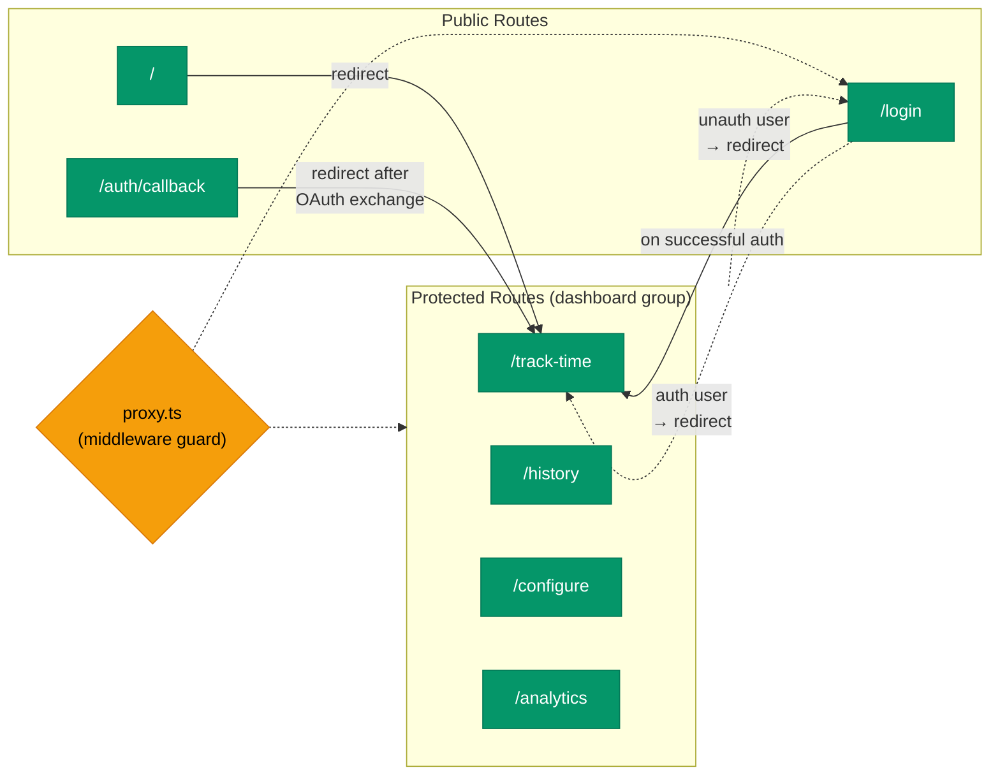

# Architecture Documentation

**Habit & Time Tracker** — A personal productivity application for tracking work time and building habits using the Pomodoro technique, with detailed analytics and configurable work categories.

> Auto-generated on 2026-02-17

---

## Table of Contents

1. [High-Level System Overview](#1-high-level-system-overview)
2. [Application Layer Architecture](#2-application-layer-architecture)
3. [Authentication & Authorization Flow](#3-authentication--authorization-flow)
4. [Core Data Flow](#4-core-data-flow)
5. [State Management & Context Hierarchy](#5-state-management--context-hierarchy)
6. [Database Schema](#6-database-schema)
7. [API Endpoints](#7-api-endpoints)
8. [Page / Route Map](#8-page--route-map)
9. [Key Technology Stack](#9-key-technology-stack)
10. [Project Structure](#10-project-structure)

---

## 1. High-Level System Overview



---

## 2. Application Layer Architecture

```
┌─────────────────────────────────────────────────────────────────────────────────┐
│  PRESENTATION LAYER                                                             │
│                                                                                 │
│  Pages (src/app/)                          Components (src/components/)          │
│  ├─ layout.tsx (root)                      ├─ time-tracking/                    │
│  ├─ page.tsx (→ redirect /track-time)      │   ├─ quick-entry-bar.tsx           │
│  ├─ login/page.tsx                         │   ├─ pomodoro-timer.tsx            │
│  ├─ auth/callback/route.ts                 │   ├─ time-entries-table.tsx        │
│  └─ (dashboard)/                           │   ├─ ongoing-task-card.tsx         │
│      ├─ layout.tsx (sidebar + banner)      │   ├─ summary-cards.tsx            │
│      ├─ track-time/page.tsx                │   ├─ bulk-upload-dialog.tsx        │
│      ├─ history/page.tsx                   │   ├─ pomodoro-details-dialog.tsx   │
│      ├─ configure/page.tsx                 │   ├─ mini-stat-card.tsx            │
│      └─ analytics/page.tsx                 │   └─ ...                           │
│                                            ├─ analytics/                        │
│                                            │   ├─ stat-card.tsx                 │
│                                            │   └─ insight-card.tsx              │
│                                            ├─ config/                           │
│                                            │   └─ editable-list.tsx             │
│                                            ├─ pomodoro-status-banner.tsx        │
│                                            └─ ui/ (32 shadcn components)       │
├─────────────────────────────────────────────────────────────────────────────────┤
│  STATE MANAGEMENT LAYER                                                         │
│                                                                                 │
│  Zustand Stores (src/store/)               Providers (src/providers/)           │
│  ├─ time-tracking-store.ts                 ├─ auth-provider.tsx (AuthContext)   │
│  │   (entries, filters, timer,             ├─ query-provider.tsx (QueryClient)  │
│  │    pomodoro sessions, realtime)         └─ theme-provider.tsx (next-themes)  │
│  ├─ pomodoro-store.ts                                                           │
│  │   (persisted: mode, timeLeft,           Hooks (src/hooks/)                   │
│  │    isRunning, config, linked task)      ├─ use-analytics-data.ts             │
│  └─ config-store.ts                        ├─ use-chart-colors.ts              │
│      (workAreas, workTypes)                └─ use-mobile.ts                     │
├─────────────────────────────────────────────────────────────────────────────────┤
│  DATA ACCESS LAYER                                                              │
│                                                                                 │
│  Supabase Clients (src/lib/supabase/)      Utilities (src/lib/)                │
│  ├─ client.ts (browser client)             ├─ analytics-utils.ts               │
│  ├─ server.ts (server client)              ├─ export-utils.ts                  │
│  ├─ config.ts (work areas/types CRUD)      ├─ excel-utils.ts                   │
│  ├─ time-entries.ts (entries CRUD +        ├─ time-utils.ts                    │
│  │                    realtime sub)         └─ utils.ts (cn helper)             │
│  └─ pomodoro-sessions.ts (sessions CRUD)                                        │
├─────────────────────────────────────────────────────────────────────────────────┤
│  AUTH / MIDDLEWARE LAYER                                                         │
│                                                                                 │
│  src/proxy.ts                              src/app/auth/callback/route.ts       │
│  (middleware-like: route protection,       (OAuth code → session exchange)      │
│   login redirect for authenticated users)                                       │
├─────────────────────────────────────────────────────────────────────────────────┤
│  TYPES (src/types/)                                                             │
│  ├─ database.types.ts   (Supabase table Row/Insert/Update types)               │
│  └─ time-tracking.ts    (Domain types: TimeEntry, PomodoroSession, etc.)       │
└─────────────────────────────────────────────────────────────────────────────────┘
```

---

## 3. Authentication & Authorization Flow



---

## 4. Core Data Flow

### 4.1 Time Entry – Add / Edit / Delete



### 4.2 Pomodoro Timer Flow



---

## 5. State Management & Context Hierarchy



---

## 6. Database Schema



> **Note:** All tables enforce Row-Level Security (RLS). Policies restrict every SELECT, INSERT, UPDATE, DELETE to `auth.uid() = user_id`.

---

## 7. API Endpoints

The app uses **Supabase client SDK** (not a custom REST API). All data operations go through the Supabase JavaScript client. Below are the Supabase table operations used:

### 7.1 Supabase Table Operations

| Table | Operation | Function | File |
|-------|-----------|----------|------|
| `time_entries` | SELECT (all) | `fetchTimeEntries()` | `src/lib/supabase/time-entries.ts` |
| `time_entries` | INSERT (single) | `createTimeEntry()` | `src/lib/supabase/time-entries.ts` |
| `time_entries` | INSERT (bulk) | `bulkCreateTimeEntries()` | `src/lib/supabase/time-entries.ts` |
| `time_entries` | UPDATE | `updateTimeEntry()` | `src/lib/supabase/time-entries.ts` |
| `time_entries` | DELETE | `deleteTimeEntry()` | `src/lib/supabase/time-entries.ts` |
| `time_entries` | SUBSCRIBE | `subscribeToTimeEntries()` | `src/lib/supabase/time-entries.ts` |
| `pomodoro_sessions` | SELECT (by entry) | `fetchPomodoroSessionsForEntry()` | `src/lib/supabase/pomodoro-sessions.ts` |
| `pomodoro_sessions` | SELECT (batch) | `fetchPomodoroSessionsForEntries()` | `src/lib/supabase/pomodoro-sessions.ts` |
| `pomodoro_sessions` | SELECT (independent) | `fetchIndependentPomodoroSessions()` | `src/lib/supabase/pomodoro-sessions.ts` |
| `pomodoro_sessions` | INSERT | `createPomodoroSession()` | `src/lib/supabase/pomodoro-sessions.ts` |
| `pomodoro_sessions` | DELETE | `deletePomodoroSession()` | `src/lib/supabase/pomodoro-sessions.ts` |
| `work_areas` | SELECT | `fetchWorkAreas()` | `src/lib/supabase/config.ts` |
| `work_areas` | INSERT | `createWorkArea()` | `src/lib/supabase/config.ts` |
| `work_areas` | INSERT (seed) | `seedDefaultWorkAreas()` | `src/lib/supabase/config.ts` |
| `work_areas` | UPDATE | `updateWorkArea()` | `src/lib/supabase/config.ts` |
| `work_areas` | UPDATE (reorder) | `reorderWorkAreas()` | `src/lib/supabase/config.ts` |
| `work_areas` | DELETE | `deleteWorkArea()` | `src/lib/supabase/config.ts` |
| `work_types` | SELECT | `fetchWorkTypes()` | `src/lib/supabase/config.ts` |
| `work_types` | INSERT | `createWorkType()` | `src/lib/supabase/config.ts` |
| `work_types` | INSERT (seed) | `seedDefaultWorkTypes()` | `src/lib/supabase/config.ts` |
| `work_types` | UPDATE | `updateWorkType()` | `src/lib/supabase/config.ts` |
| `work_types` | UPDATE (reorder) | `reorderWorkTypes()` | `src/lib/supabase/config.ts` |
| `work_types` | DELETE | `deleteWorkType()` | `src/lib/supabase/config.ts` |

### 7.2 Next.js Route Handlers

| Method | Path | Description | Auth Required |
|--------|------|-------------|---------------|
| GET | `/auth/callback` | OAuth code exchange & session creation | No (establishes auth) |

---

## 8. Page / Route Map



### Route Details

| Route | Layout | Page Component | Description |
|-------|--------|----------------|-------------|
| `/` | Root | `page.tsx` | Redirects to `/track-time` |
| `/login` | Root | `login/page.tsx` | Email/password + Google OAuth login |
| `/auth/callback` | — | `auth/callback/route.ts` | Server route handler for OAuth callback |
| `/track-time` | Dashboard | `(dashboard)/track-time/page.tsx` | Main time tracking + Pomodoro timer |
| `/history` | Dashboard | `(dashboard)/history/page.tsx` | Full searchable/filterable time entries table |
| `/configure` | Dashboard | `(dashboard)/configure/page.tsx` | Manage work areas & work types |
| `/analytics` | Dashboard | `(dashboard)/analytics/page.tsx` | Charts, stats, and insights |

---

## 9. Key Technology Stack

| Layer | Technology | Version | Purpose |
|-------|------------|---------|---------|
| **Framework** | Next.js | 16.x | App Router, SSR, file-based routing |
| **UI Library** | React | 19.x | Component rendering |
| **Language** | TypeScript | 5.x | Static type safety |
| **Build Tool** | Turbopack | Built-in | Fast dev server bundling |
| **CSS Framework** | Tailwind CSS | 4.x | Utility-first styling with CSS variables |
| **Component Library** | shadcn/ui (New York) | Latest | 32 pre-built Radix-based components |
| **Component Primitives** | Radix UI | Various | Accessible headless UI primitives |
| **State Management** | Zustand | 5.x | Lightweight global stores (3 stores) |
| **Server State** | TanStack Query | 5.x | Query client with 60s stale time |
| **Backend / Database** | Supabase | 2.89+ | PostgreSQL, Auth, Realtime |
| **Supabase Client** | @supabase/ssr | 0.8+ | SSR-compatible Supabase client |
| **Charts** | Recharts | 2.x | Bar, pie/donut, line charts |
| **Icons** | Lucide React | 0.562+ | Icon library |
| **Forms** | React Hook Form | 7.x | Form state management |
| **Validation** | Zod | 4.x | Schema validation |
| **Date Utilities** | date-fns | 4.x | Date formatting and manipulation |
| **Notifications** | Sonner | 2.x | Toast notifications |
| **Theme** | next-themes | 0.4+ | Dark / light / system mode |
| **Drag & Drop** | @dnd-kit | 6.x + 10.x | Sortable drag-and-drop lists |
| **Tables** | TanStack Table | 8.x | Headless data table with sorting/pagination |
| **Excel Parsing** | xlsx (SheetJS) | 0.18.x | Bulk upload Excel parsing |
| **CSS Animation** | tw-animate-css | 1.4+ | Tailwind animation utilities |
| **Class Utilities** | clsx + tailwind-merge | Latest | Conditional class merging |
| **Class Variants** | class-variance-authority | 0.7+ | Component variant definitions |
| **Linting** | ESLint + typescript-eslint | 9.x + 8.x | Code quality |

---

## 10. Project Structure

```
src/
├── app/                                 # Next.js App Router (pages & layouts)
│   ├── layout.tsx                       # Root layout: ThemeProvider → AuthProvider → QueryProvider → Toaster
│   ├── page.tsx                         # Home route: instant redirect to /track-time
│   ├── globals.css                      # Tailwind v4 config, CSS variables (light + dark), base resets
│   ├── favicon.ico                      # App favicon
│   ├── login/
│   │   └── page.tsx                     # Login page: email/password + Google OAuth
│   ├── auth/
│   │   └── callback/
│   │       └── route.ts                 # Server route: exchanges OAuth code for session
│   ├── (dashboard)/                     # Route group: shared sidebar layout for all dashboard pages
│   │   ├── layout.tsx                   # Dashboard layout: Sidebar nav + SignOut dialog + PomodoroStatusBanner
│   │   ├── track-time/
│   │   │   └── page.tsx                 # Time tracking: QuickEntry, OngoingTasks, PomodoroTimer, SummaryCards
│   │   ├── history/
│   │   │   └── page.tsx                 # Full history: searchable/filterable TimeEntriesTable
│   │   ├── configure/
│   │   │   └── page.tsx                 # Configuration: drag-and-drop EditableLists for work areas & types
│   │   └── analytics/
│   │       └── page.tsx                 # Analytics: period selector, stat cards, donut/bar/trend charts
│   └── tutorials/                       # (Empty — reserved for future tutorials)
│
├── components/                          # Reusable React components
│   ├── time-tracking/                   # Time tracking feature components
│   │   ├── quick-entry-bar.tsx          # Form bar for adding time entries with datetime inputs
│   │   ├── pomodoro-timer.tsx           # Full Pomodoro timer with mode tabs, controls, form fields
│   │   ├── time-entries-table.tsx        # Data table with inline editing, search, filters, pagination
│   │   ├── ongoing-task-card.tsx        # Card displaying a running task with duration counter
│   │   ├── summary-cards.tsx            # Four stat cards: total time, pomodoros, sessions, most worked
│   │   ├── bulk-upload-dialog.tsx       # Multi-step Excel upload dialog (upload → preview → confirm)
│   │   ├── pomodoro-details-dialog.tsx  # Dialog showing pomodoro sessions for a time entry
│   │   ├── mini-stat-card.tsx           # Small stat display component
│   │   ├── complete-task-button.tsx     # Button to complete an ongoing task
│   │   ├── quick-start-task.tsx         # Quick start task component
│   │   ├── recent-task-item.tsx         # Recent task list item
│   │   └── timer-hero.tsx              # Timer hero display component
│   ├── analytics/                       # Analytics feature components
│   │   ├── stat-card.tsx                # Large statistic card with trend indicator (↑/↓ %)
│   │   └── insight-card.tsx             # Insight card with icon and value
│   ├── config/                          # Configuration feature components
│   │   └── editable-list.tsx            # Drag-and-drop reorderable list with add/edit/delete
│   ├── pomodoro-status-banner.tsx       # Global floating banner when Pomodoro runs on non-timer pages
│   ├── tutorials/                       # (Empty — reserved for future tutorials)
│   └── ui/                              # shadcn/ui components (32 installed)
│       ├── alert-dialog.tsx             # Modal confirmation dialogs
│       ├── avatar.tsx                   # User avatar display
│       ├── badge.tsx                    # Status badges
│       ├── button.tsx                   # Button with variants (default, destructive, outline, etc.)
│       ├── calendar.tsx                 # Date picker calendar (react-day-picker)
│       ├── card.tsx                     # Card container with header, content, footer
│       ├── chart.tsx                    # Recharts wrapper (ChartContainer, ChartTooltip, etc.)
│       ├── checkbox.tsx                 # Checkbox input
│       ├── combobox.tsx                 # Searchable dropdown select (custom)
│       ├── command.tsx                  # Command palette / search (cmdk)
│       ├── datetime-input.tsx           # DateTime input component (custom)
│       ├── dialog.tsx                   # Modal dialog
│       ├── dropdown-menu.tsx            # Dropdown menu
│       ├── form.tsx                     # React Hook Form integration
│       ├── input.tsx                    # Text input
│       ├── input-group.tsx              # Input with addon buttons (custom)
│       ├── label.tsx                    # Form label
│       ├── popover.tsx                  # Popover overlay
│       ├── progress.tsx                 # Progress bar
│       ├── select.tsx                   # Select dropdown
│       ├── separator.tsx               # Visual separator
│       ├── sheet.tsx                    # Slide-out panel
│       ├── sidebar.tsx                  # Collapsible sidebar navigation
│       ├── skeleton.tsx                 # Loading skeleton placeholder
│       ├── sonner.tsx                   # Toast notification (Sonner wrapper)
│       ├── switch.tsx                   # Toggle switch
│       ├── table.tsx                    # Data table primitives
│       ├── tabs.tsx                     # Tab navigation
│       ├── textarea.tsx                 # Multi-line text input
│       ├── theme-toggle.tsx             # Dark/light mode toggle button (custom)
│       ├── time-input.tsx               # Time input component (custom)
│       └── tooltip.tsx                  # Tooltip overlay
│
├── hooks/                               # Custom React hooks
│   ├── use-analytics-data.ts            # Computes analytics from time entries store (memoized)
│   ├── use-chart-colors.ts              # Reads CSS variable chart colors at runtime for Recharts
│   └── use-mobile.ts                    # Media query hook for mobile breakpoint (768px)
│
├── lib/                                 # Utility libraries and data access
│   ├── supabase/                        # Supabase client & data access functions
│   │   ├── client.ts                    # Browser-side Supabase client (createBrowserClient)
│   │   ├── server.ts                    # Server-side Supabase client (createServerClient + cookies)
│   │   ├── config.ts                    # CRUD for work_areas & work_types + seeding defaults
│   │   ├── time-entries.ts              # CRUD + bulk + realtime subscription for time_entries
│   │   └── pomodoro-sessions.ts         # CRUD for pomodoro_sessions
│   ├── analytics-utils.ts               # Analytics computation: stats, breakdowns, trends, insights
│   ├── export-utils.ts                  # CSV export for time entries
│   ├── excel-utils.ts                   # Excel parsing for bulk upload (SheetJS)
│   ├── time-utils.ts                    # Duration formatting, time calculations
│   └── utils.ts                         # General utilities (cn class merger)
│
├── providers/                           # React Context providers
│   ├── auth-provider.tsx                # AuthContext: user, session, loading, signOut
│   ├── query-provider.tsx               # TanStack QueryClientProvider (staleTime: 60s)
│   └── theme-provider.tsx               # next-themes ThemeProvider wrapper
│
├── store/                               # Zustand global stores
│   ├── time-tracking-store.ts           # Time entries state, CRUD, realtime, filters, pomodoro sessions
│   ├── pomodoro-store.ts                # Pomodoro timer state (persisted to localStorage)
│   └── config-store.ts                  # Work areas & work types state
│
├── types/                               # TypeScript type definitions
│   ├── database.types.ts                # Supabase-generated table types (Row/Insert/Update)
│   └── time-tracking.ts                 # Domain types: TimeEntry, PomodoroSession, WorkArea, etc.
│
└── proxy.ts                             # Middleware-like route protection (checks auth, redirects)

public/                                  # Static assets served at root
├── file.svg
├── globe.svg
├── next.svg
├── vercel.svg
└── window.svg

Root config files:
├── package.json                         # Dependencies and scripts
├── next.config.ts                       # Next.js configuration
├── tsconfig.json                        # TypeScript config (bundler module resolution, @/* paths)
├── postcss.config.mjs                   # PostCSS with @tailwindcss/postcss plugin
├── components.json                      # shadcn/ui config (new-york style, Tailwind CSS vars, Lucide icons)
├── eslint.config.mjs                    # ESLint flat config (typescript-eslint + react-hooks)
├── PRD.md                               # Full product requirements document
├── Project-context.md                   # Brief project context
├── SETUP.md                             # Setup and installation guide
└── README.md                            # Project readme
```
