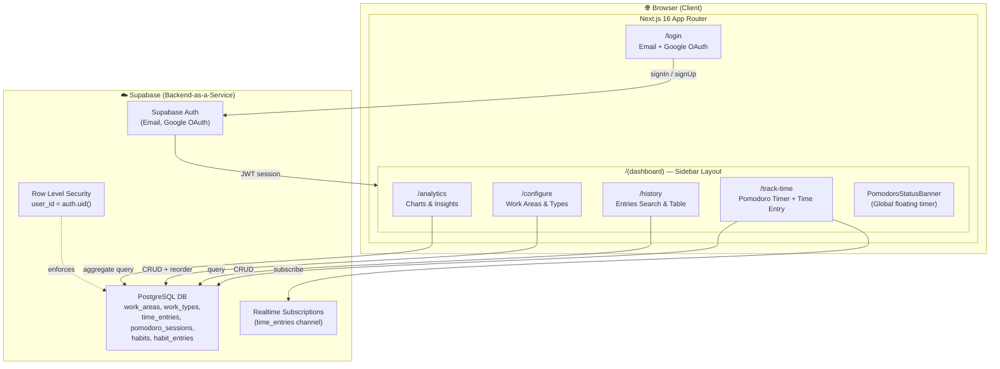
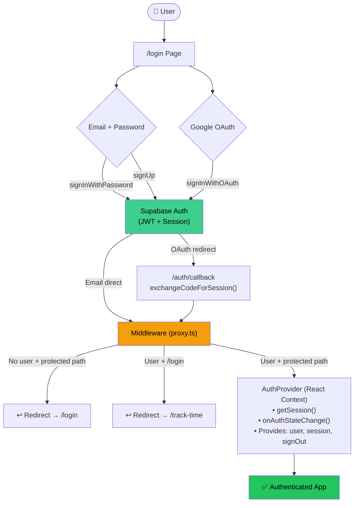
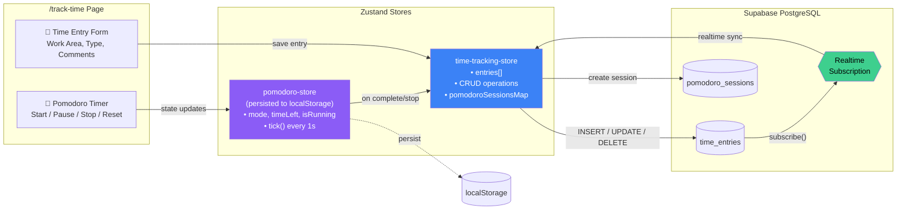
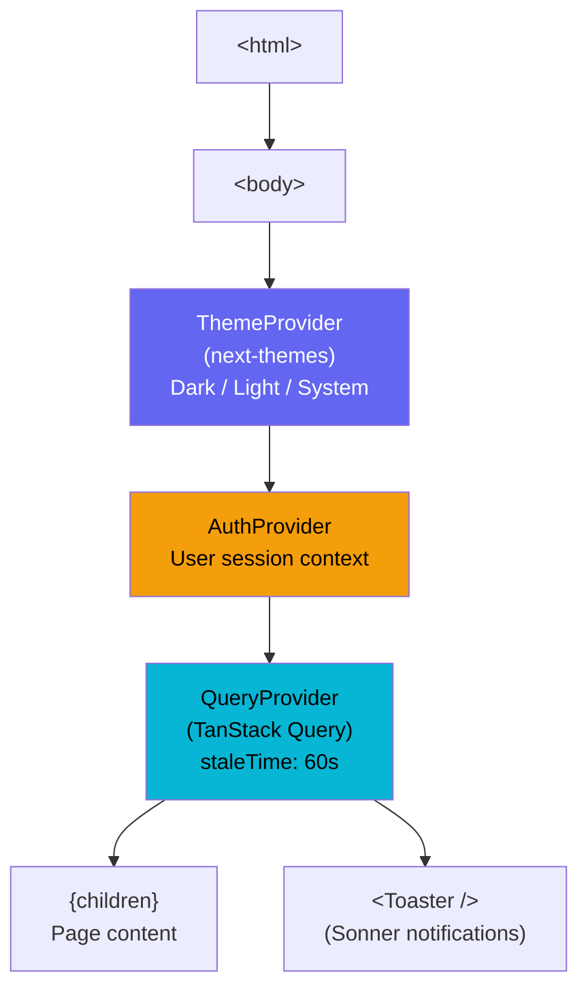
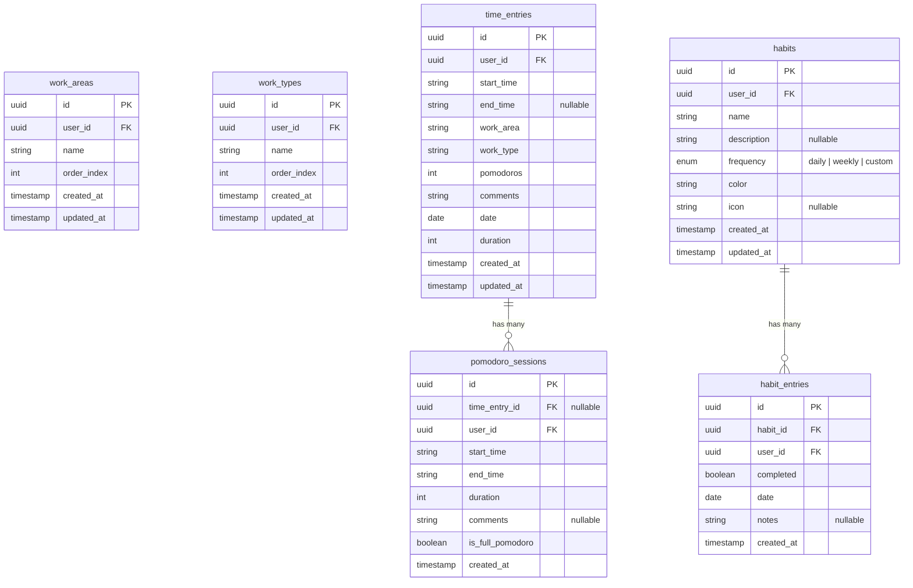
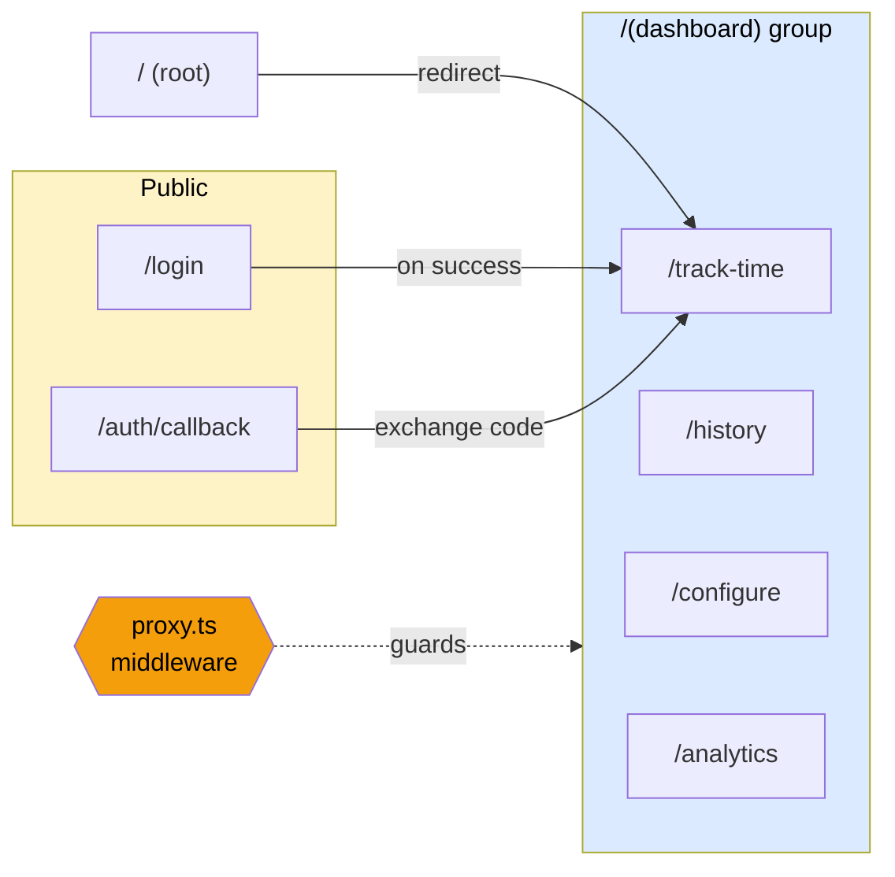

# Habit & Time Tracker — Architecture Diagram

## High-Level System Overview



---

## Application Layer Architecture

```
┌──────────────────────────────────────────────────────────────────────┐
│                        PRESENTATION LAYER                            │
│                                                                      │
│   Pages (src/app/)              Components (src/components/)         │
│   ┌──────────────────┐          ┌───────────────────────────┐       │
│   │ (dashboard)/     │          │ time-tracking/            │       │
│   │   track-time     │◄────────►│   pomodoro-timer          │       │
│   │   history        │          │                           │       │
│   │   configure      │          │ analytics/                │       │
│   │   analytics      │          │   (charts, stats)         │       │
│   │                  │          │                           │       │
│   │ login/           │          │ config/                   │       │
│   │ auth/callback    │          │   (work areas/types mgmt) │       │
│   └──────────────────┘          │                           │       │
│                                 │ ui/ (shadcn components)   │       │
│                                 │   button, card, dialog,   │       │
│                                 │   table, chart, calendar, │       │
│                                 │   select, input, form...  │       │
│                                 └───────────────────────────┘       │
└──────────────────────┬───────────────────────────────────────────────┘
                       │
                       ▼
┌──────────────────────────────────────────────────────────────────────┐
│                         STATE LAYER                                  │
│                                                                      │
│   Zustand Stores (src/store/)       React Context (src/providers/)  │
│   ┌─────────────────────────┐       ┌────────────────────────────┐  │
│   │ time-tracking-store     │       │ AuthProvider               │  │
│   │  • entries[]            │       │  • user, session, loading  │  │
│   │  • CRUD operations      │       │  • signOut()               │  │
│   │  • realtime sync        │       ├────────────────────────────┤  │
│   │  • pomodoro sessions    │       │ QueryProvider              │  │
│   ├─────────────────────────┤       │  • TanStack Query client   │  │
│   │ config-store            │       │  • staleTime: 60s          │  │
│   │  • workAreas[]          │       ├────────────────────────────┤  │
│   │  • workTypes[]          │       │ ThemeProvider (next-themes) │  │
│   │  • CRUD + reorder       │       │  • system/light/dark       │  │
│   ├─────────────────────────┤       └────────────────────────────┘  │
│   │ pomodoro-store          │                                       │
│   │  • timer state          │       Hooks (src/hooks/)              │
│   │  • mode, timeLeft       │       ┌────────────────────────────┐  │
│   │  • persisted to         │       │ useAnalyticsData           │  │
│   │    localStorage         │       │ useChartColors             │  │
│   │  • survives page        │       │ useMobile                  │  │
│   │    reload               │       └────────────────────────────┘  │
│   └─────────────────────────┘                                       │
└──────────────────────┬───────────────────────────────────────────────┘
                       │
                       ▼
┌──────────────────────────────────────────────────────────────────────┐
│                       DATA ACCESS LAYER                              │
│                                                                      │
│   Supabase Client Modules (src/lib/supabase/)                       │
│   ┌──────────────────┐  ┌─────────────────┐  ┌─────────────────┐   │
│   │ client.ts        │  │ server.ts       │  │ config.ts       │   │
│   │ Browser client   │  │ Server client   │  │ WorkArea CRUD   │   │
│   │ (createBrowser   │  │ (createServer   │  │ WorkType CRUD   │   │
│   │  Client)         │  │  Client)        │  │ Seed defaults   │   │
│   ├──────────────────┤  └─────────────────┘  └─────────────────┘   │
│   │ time-entries.ts  │  ┌─────────────────────────────────────────┐ │
│   │ CRUD + realtime  │  │ pomodoro-sessions.ts                   │ │
│   │ subscribe        │  │ Create / Fetch / Bulk fetch sessions   │ │
│   │ bulk create      │  └─────────────────────────────────────────┘ │
│   └──────────────────┘                                              │
│                                                                      │
│   Utilities (src/lib/)                                              │
│   ┌──────────────────┐  ┌─────────────────┐  ┌─────────────────┐   │
│   │ analytics-utils  │  │ time-utils      │  │ export-utils    │   │
│   │ Stats, trends,   │  │ Duration calc,  │  │ Excel export    │   │
│   │ insights         │  │ formatting      │  │ (xlsx)          │   │
│   └──────────────────┘  └─────────────────┘  └─────────────────┘   │
└──────────────────────────────────────────────────────────────────────┘
```

---

## Authentication Flow



---

## Data Flow: Time Tracking & Pomodoro



---

## Provider Hierarchy (Root Layout)



---

## Database Schema (Supabase PostgreSQL)



---

## Page Routing Map



---

## Key Technology Stack

| Layer            | Technology                          | Purpose                                  |
|------------------|--------------------------------------|------------------------------------------|
| Framework        | Next.js 16 (App Router, Turbopack)  | SSR, routing, API routes                 |
| UI Library       | React 19                            | Component rendering                      |
| Component Lib    | shadcn/ui + Radix Primitives        | Pre-built accessible components          |
| Styling          | Tailwind CSS v4                     | Utility-first CSS                        |
| State (Client)   | Zustand (w/ persist middleware)     | Client-side stores                       |
| State (Server)   | TanStack Query                      | Server state & caching                   |
| Forms            | React Hook Form + Zod              | Form handling & validation               |
| Backend          | Supabase (Auth, DB, Realtime)       | BaaS — PostgreSQL, Auth, Subscriptions   |
| Charts           | Recharts (via shadcn Chart)         | Analytics visualizations                 |
| Tables           | TanStack Table                      | Data tables with sorting/filtering       |
| Drag & Drop      | @dnd-kit                            | Reordering work areas/types              |
| Icons            | Lucide React                        | Icon set                                 |
| Theming          | next-themes                         | Dark/light mode                          |
| Notifications    | Sonner                              | Toast notifications                      |
| Date Utils       | date-fns                            | Date formatting & manipulation           |
| Export           | xlsx                                | Excel export of time entries             |

---

## File Organization Summary

```
src/
├── app/                          # Next.js App Router pages
│   ├── layout.tsx                # Root layout (providers)
│   ├── page.tsx                  # Redirect → /track-time
│   ├── login/page.tsx            # Auth page
│   ├── auth/callback/route.ts    # OAuth callback handler
│   └── (dashboard)/              # Protected route group
│       ├── layout.tsx            # Sidebar + navigation
│       ├── track-time/page.tsx   # Timer + entry form
│       ├── history/page.tsx      # Past entries table
│       ├── configure/page.tsx    # Work areas/types config
│       └── analytics/page.tsx    # Charts & insights
├── components/
│   ├── ui/                       # shadcn components
│   ├── time-tracking/            # Timer, entry components
│   ├── analytics/                # Chart components
│   ├── config/                   # Config management
│   └── pomodoro-status-banner    # Global floating timer
├── store/                        # Zustand stores
│   ├── time-tracking-store.ts    # Time entries state
│   ├── pomodoro-store.ts         # Timer state (persisted)
│   └── config-store.ts           # Work areas/types state
├── providers/                    # React context providers
│   ├── auth-provider.tsx         # Supabase auth context
│   ├── query-provider.tsx        # TanStack Query
│   └── theme-provider.tsx        # Dark/light mode
├── lib/
│   ├── supabase/                 # Supabase client & data access
│   │   ├── client.ts             # Browser client
│   │   ├── server.ts             # Server client
│   │   ├── time-entries.ts       # Time entry CRUD
│   │   ├── pomodoro-sessions.ts  # Pomodoro session CRUD
│   │   └── config.ts             # Work area/type CRUD
│   ├── analytics-utils.ts        # Stats computation
│   ├── time-utils.ts             # Duration formatting
│   └── export-utils.ts           # Excel export
├── hooks/                        # Custom React hooks
├── types/                        # TypeScript types
│   ├── database.types.ts         # Supabase DB schema
│   └── time-tracking.ts          # App-level types
└── proxy.ts                      # Auth middleware
```
